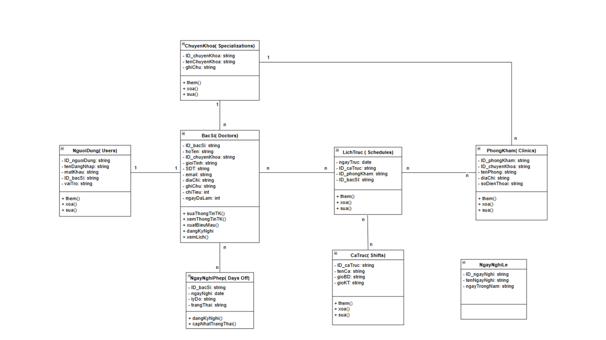
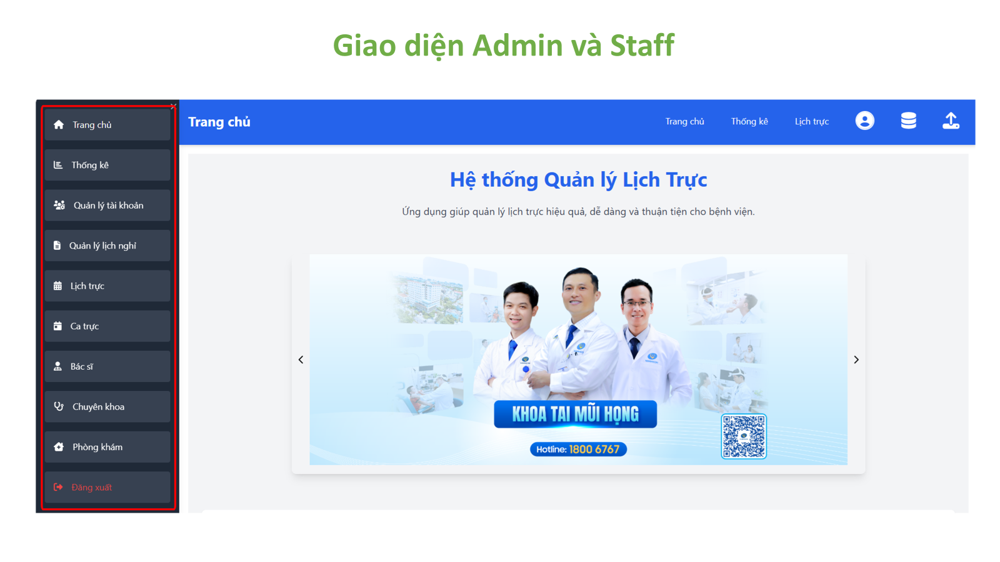
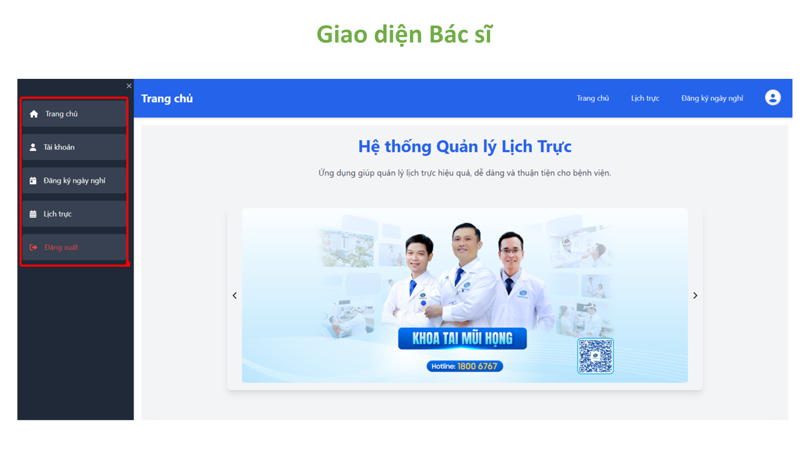
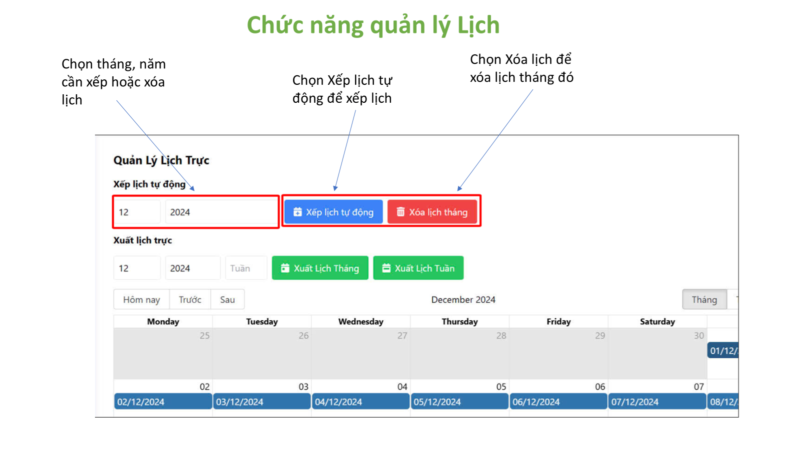
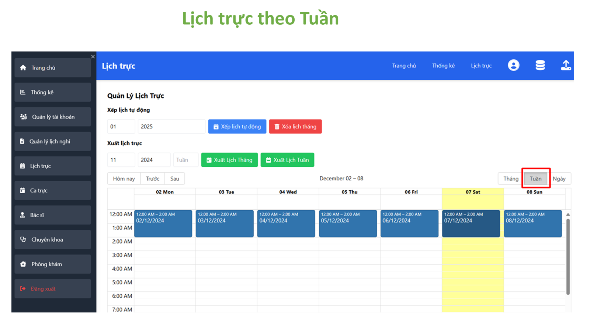
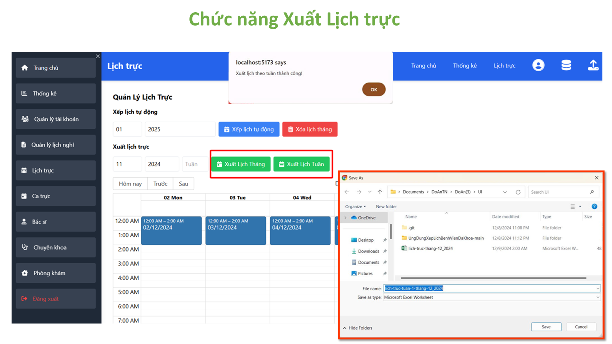
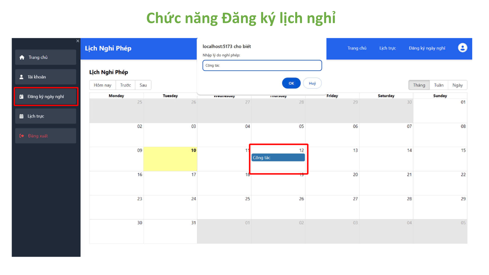

# Website Quản Lý Lịch Trực Bệnh Viện Đa Khoa

## 📋 Mô tả dự án
Website Quản Lý Lịch Trực Bệnh Viện Đa Khoa là một giải pháp quản lý toàn diện cho lịch trực của bệnh viện. Dự án cung cấp các chức năng tối ưu hóa việc sắp xếp lịch trực, quản lý thông tin bác sĩ, phòng ban, chuyên khoa và nhiều tính năng hữu ích khác nhằm hỗ trợ quy trình làm việc hiệu quả trong môi trường bệnh viện.

## 👥 Thành viên nhóm
Số lượng thành viên: **03**

## 🛠 Công nghệ sử dụng
- **Front-end**:  
  - **Ngôn ngữ:** React TypeScript  
  - **Frameworks/Thư viện:** Tailwind CSS, PrimeReact, React Router DOM, Axios  
  - **Các công cụ UI hỗ trợ:** FontAwesome, PrimeIcons  

- **Back-end**:  
  - **Ngôn ngữ:** .NET Webcore API  
  - **Thư viện chính:** EPPlus (xuất file Excel), MongoDB.Driver (kết nối với MongoDB), Swashbuckle.AspNetCore (Swagger tài liệu hóa API)  

- **Database**: MongoDB  

## ✨ Các chức năng chính
- **CRUD**:
  - Quản lý thông tin Bác sĩ, Phòng ban, Chuyên khoa, Ca trực, Lịch trực...
- **Quản lý ngày nghỉ**:
  - Cho phép bác sĩ đăng ký và quản lý ngày nghỉ phép.
- **Xếp lịch tự động**:
  - Hệ thống xếp lịch thông minh, tối ưu hóa thời gian và nguồn lực.
- **Tính ngày công**:
  - Hỗ trợ tính toán công việc của bác sĩ chi tiết.
- **Xuất lịch trực**:
  - Xuất file lịch trực hàng tuần/tháng dễ dàng.

## 📂 Cấu trúc dự án
### **Front-end**
- **Công nghệ**: ReactTS
- **Thư mục chính**:
  - `/src/components`: Chứa các thành phần giao diện (UI).
  - `/src/pages`: Các trang chính của ứng dụng.
  - 
### **Back-end**
- **Công nghệ**: .NET Webcore API
- **Thư mục chính**:
  - `/Controllers`: Chứa các controller để xử lý API.
  - `/Models`: Chứa các model dữ liệu.
  - `/Repositories`: Chứa các logic nghiệp vụ liên quan đến database.
  - `/Interfaces`: Chứa các interface để định nghĩa

## 📈 Hướng dẫn cài đặt và chạy dự án
### Yêu cầu:
1. **Node.js** và **npm** hoặc **yarn**.
2. **.NET Core SDK**.
3. **MongoDB** được cài đặt và cấu hình.

### Cài đặt Front-end:
1. Clone repository.
2. Điều hướng đến thư mục Front-end:
   cd /UngDungXepLichBenhVienDaKhoa
3. Cài đặt dependencies:
  npm install
4. Chạy ứng dụng:
  npm run dev

### Cài đặt Back-end:
1. Clone repository.
2. Điều hướng đến thư mục Backend-end:
   cd / BVDK_API_backend
3. Chạy ứng dụng:
  Nhấn chạy hoặc dùng lệnh
    cd BVĐK_API
    dotnet watch run
<<<<<<< HEAD
---

## Giao diện & Chức năng

### 🔷 Cơ sở dữ liệu

### 🔷 Giao diện Admin và Nhân viên

### 🔷 Giao diện Bác sĩ

### 🔷 Tạo & Xoá lịch trực theo tháng
> Cho phép xếp lịch trực tự động và xoá lịch trực của tháng đã chọn.

### 🔷 Quản lý lịch trực trong ngày
> Tìm kiếm theo tên bác sĩ, lọc theo ca trực và phòng khám. Có thể thêm, sửa, xoá ca trực trong ngày.

### 🔷 Xem lịch trực theo tuần

### 🔷 Xuất lịch trực
> Hỗ trợ xuất file Excel theo tháng hoặc tuần.

### 🔷 Đăng ký lịch nghỉ
> Chức năng dành cho bác sĩ để đăng ký ngày nghỉ và lý do.

=======
   
## 🗂️ Cấu trúc cơ sở dữ liệu

- **Sơ đồ cơ sở dữ liệu tổng quát:**  
  

## 🖼️ Giao diện hệ thống

- **Giao diện Admin và Staff:**  
  

- **Giao diện Bác sĩ:**  
  

- **Chức năng quản lý lịch trực:**  
  

- **Lịch trực theo tuần:**  
  

- **Chức năng xuất lịch trực:**  
  

- **Chức năng đăng ký lịch nghỉ:**  
  

